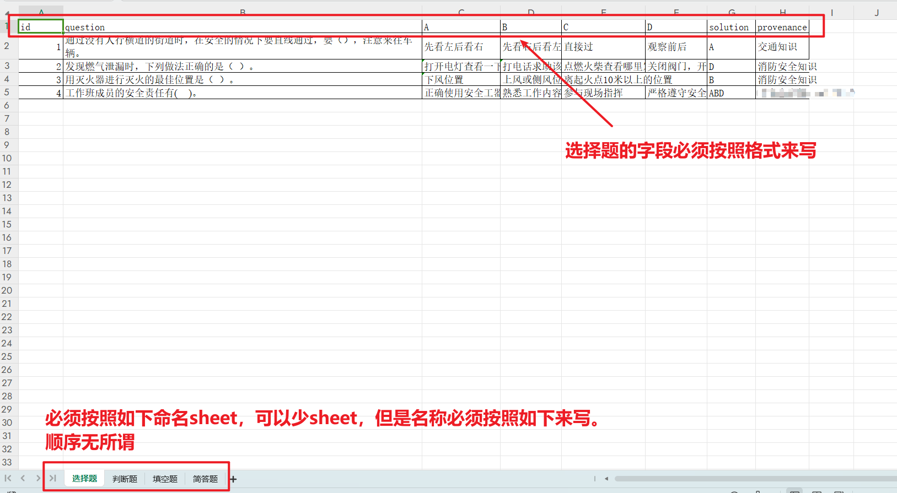
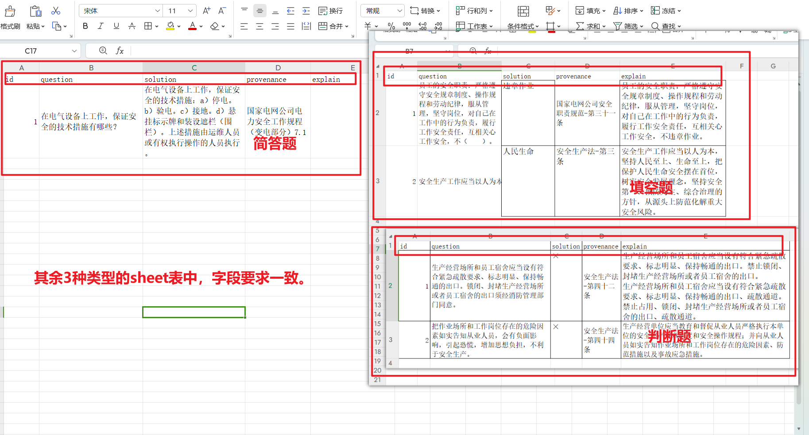

## 考试练习小工具

- 打包命令为 :
```
pyinstaller --add-data "icon/*;./icon"  --onefile main.py --noconsole
pyinstaller -i "E:\Work-Script\Question-and-answer tool\icon\9035903_skull_sharp_icon.ico" -F -D main.py --noconsole
```

- Excel格式要求为 :



